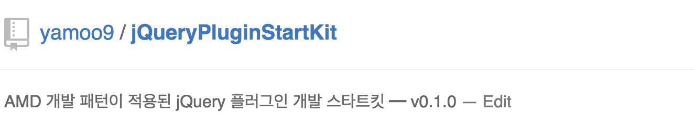

## 웹 접근성을 고려한 jQuery 플러그인 제작 과정

- [01일차 내용 요약](DOC/DAY01.md)
- [02일차 내용 요약](DOC/DAY02.md)
- [03일차 내용 요약](DOC/DAY03.md)
- [04일차 내용 요약](DOC/DAY04.md)
- [05일차 내용 요약](DOC/DAY05.md)
- [06일차 내용 요약](DOC/DAY06.md)
- [07일차 내용 요약](DOC/DAY07.md)
- [08일차 내용 요약](DOC/DAY08.md)
- [09일차 내용 요약](DOC/DAY09.md)
- [10일차 내용 요약](DOC/DAY10.md)
- [11일차 내용 요약](DOC/DAY11.md)
- [12일차 내용 요약](DOC/DAY12.md)
- [13일차 내용 요약](DOC/DAY13.md)

---

---

### 내비게이션바 jQuery 플러그인 제작

#### 참고 URL

###### 국내
- [OCN](http://ch.interest.me/ocn)
- [daumkakao](http://www.daumkakao.com/main)
- [privacy.daumkakao](http://privacy.daumkakao.com/main)
- [KIPFA](http://www.kipfa.or.kr/)
- [홈플러스](http://direct.homeplus.co.kr/)
- [위메프](http://www.wemakeprice.com/)
- [콘텐츠코리아랩](https://www.ckl.or.kr:446/www/main/userMain/main.do)

###### 국외
- [jquery](http://jquery.com/)
- [phonegap](http://phonegap.com/)
- [cordova](https://cordova.apache.org/)
- [angularjs](https://www.angularjs.org/)
- [goal.com](http://www.goal.com/en/)
- [forbes](http://www.forbes.com/)

#### 내비게이션 제작을 위한 고려사항
[접근성/사용성 높은 내비게이션 제작 방법](/DOC/DAY11.md#내비게이션-위젯에-접근성-향상을-위한-wai-aria-적용)