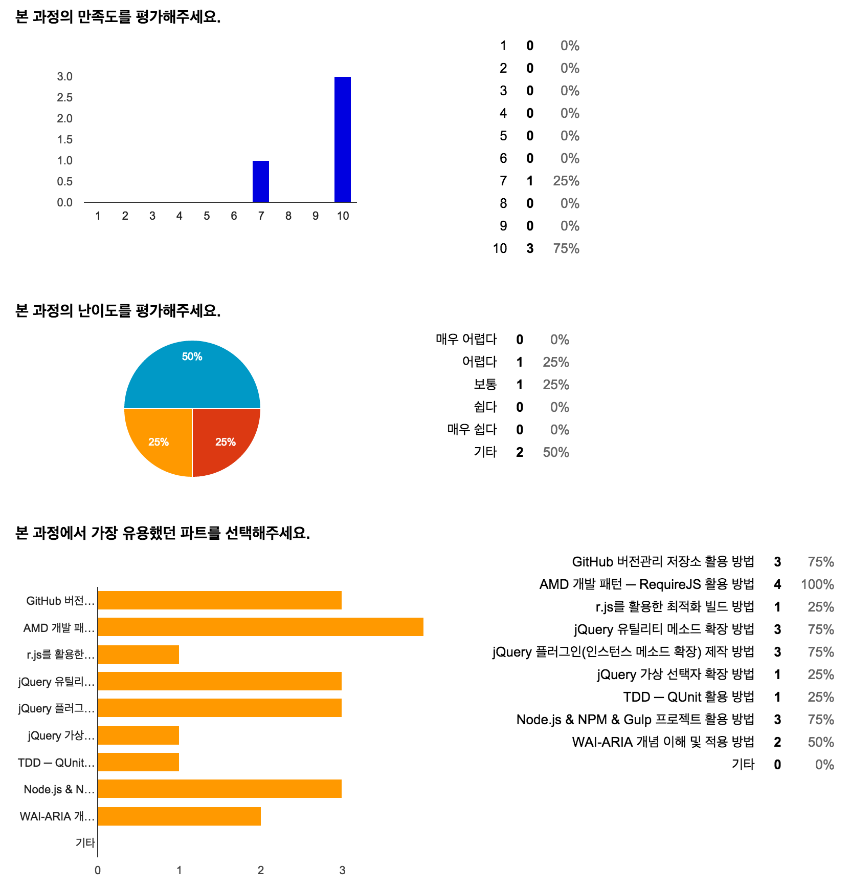

`Final Day`

### 웹 접근성을 준수한 jQuery 플러그인 제작 과정

어느새 수업 마무리 날이 되었네요. 그 동안 공부했던 내용을 총 집결하여 플러그인 제작 과정을 정리해봤습니다. 각 과정을 STEP 별로 확인하여 jQuery 플러그인을 제작하는 과정을 익혀보세요. ^ㅡ^

**[jQueryPluginStartKit](https://github.com/yamoo9/jQueryPluginStartKit)**

- [플러그인 제작 프로세스 ━ STEP 1](https://github.com/yamoo9/jQueryPluginStartKit/blob/01-%ED%94%8C%EB%9F%AC%EA%B7%B8%EC%9D%B8-%EC%9E%91%EC%84%B1-%EC%A4%80%EB%B9%84/README.md)
- [플러그인 제작 프로세스 ━ STEP 2](https://github.com/yamoo9/jQueryPluginStartKit/blob/02-%ED%94%8C%EB%9F%AC%EA%B7%B8%EC%9D%B8-%EC%B4%88%EA%B8%B0%ED%99%94/README.md)
- [플러그인 제작 프로세스 ━ STEP 3](https://github.com/yamoo9/jQueryPluginStartKit/blob/03-%ED%94%8C%EB%9F%AC%EA%B7%B8%EC%9D%B8-%EC%9D%B4%EB%B2%A4%ED%8A%B8-%EC%84%A4%EC%A0%95/README.md)

-

### 참고자료
- [Chrome DevTool 단축키](https://developer.chrome.com/devtools/docs/shortcuts)
- WAI-ARIA
	- [WAI-ARIA와 JavaScript를 이용한 웹 접근성 구현방법 (국내 세미나 영상)](https://youtu.be/9ecDB3as774)
	- [실용 WAI-ARIA 적용 사례 (해외)](http://heydonworks.com/practical_aria_examples/)
	- [OAA(OpenAjax Alliance A11y) 예제 (해외)](http://oaa-accessibility.org/examples/)

-

### 과정 후기

아직 과정 후기 [설문조사](http://url.yamoo9.net/jquerysurvey)에 참여하지 않으신 분들은 참여 부탁드립니다. ^ㅡ^

