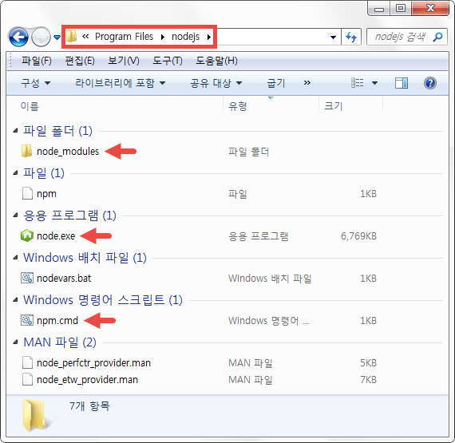
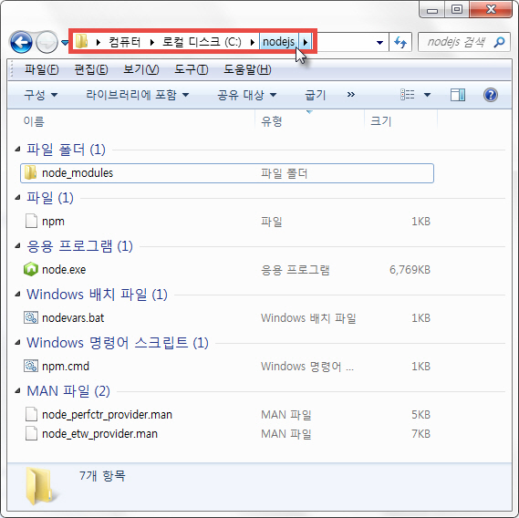
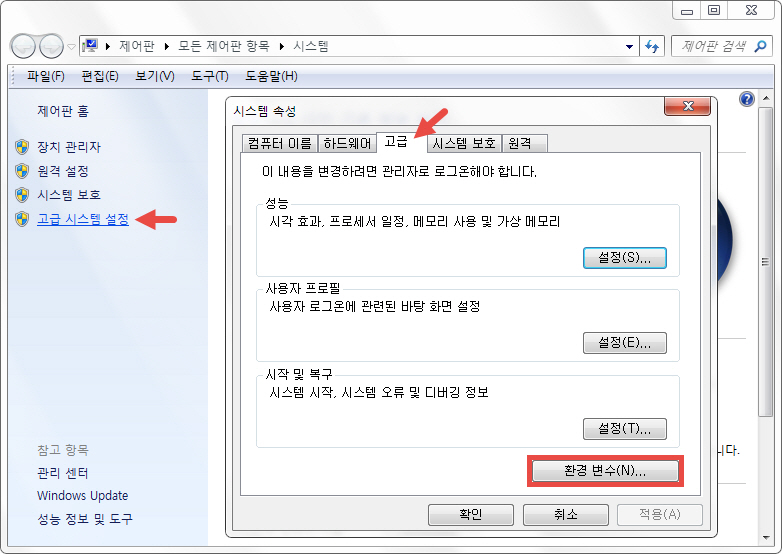
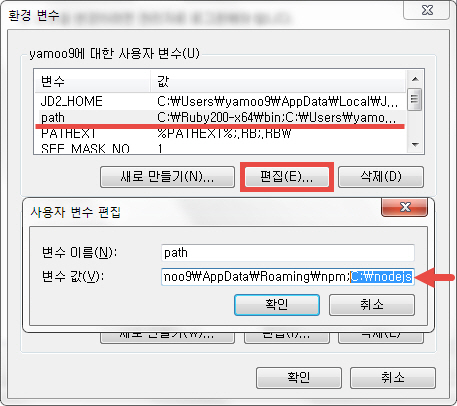

## 웹 접근성을 고려한 jQuery 플러그인 제작 과정

#### 1일차 "Git & Node.js 환경 구성"

* [Git](http://git-scm.com/) 설치 : **Git Bash** 명령어 툴 활용<br>
```sh
$ git --version # 설치된 Git 버전 체크
```

* **.gitignore** 파일의 역할 - 버전 관리하고싶지 않은 폴더/파일 설정

* [GitHub](http://github.com/) 무료 계정 등록 및 [GUI 툴](http://windows.github.com) 설치/활용

* [Node.js](http://nodejs.org/) 설치
```sh
$ node --version # 설치된 Node 버전 체크
```

* [NPM](http://npmjs.org/) 모듈 설치/관리
```sh
# NPM을 활용한 Node.js 모듈 설치
$ npm -v # npm --version
$ npm install {Module_name} # e.g) jquery 모듈설치: npm i jquery
```

-

#### Node.js 환경변수 설정

설치한 nodejs 폴더를 다른 곳으로 옮길 경우, 환경변수 설정이 필요합니다.
예로 동일한 강의장을 사용하는 `JAVA & Android` 수업 환경으로 발생한
Git Bash에서 `node` 명령을 사용할 수 없는 문제 해결을 위해 환경변수를
올바르게 설정 변경해야 합니다.

∨

**수업 시간에 기본 설치한 nodejs 폴더 내부 파일 구성**

* `node.exe` - Node.js 실행 파일. 환경변수에 추가하면 어디서나 Node.js 수행 가능.
* `npm.cmd` - Node.js 모듈 설치 시, 사용하는 NPM 실행 파일.
* `node_modules` - Node.js 모듈이 설치되는 디렉토리.



-

**Node.js 폴더 경로 복사**

nodejs 폴더의 경로를 마우스로 선택한 후, 오른쪽 버튼을 눌러 `주소복사` 선택<br>
`e.g) nodejs 폴더가 설치 이후, 변경된 경우`



-

**환경변수 설정 Part.1**

`제어판` > `고급 시스템 설정` > `시스템 속성(고급)` > `환경변수`




-

**환경변수 설정 Part.2**

`환경변수` > `사용자 변수` > `path` > `편집` > `Node.js 폴더 경로 추가` > `확인`




<!-- [Node.js 사용자 환경변수 추가](http://combatguri.tistory.com/m/post/11) -->

---